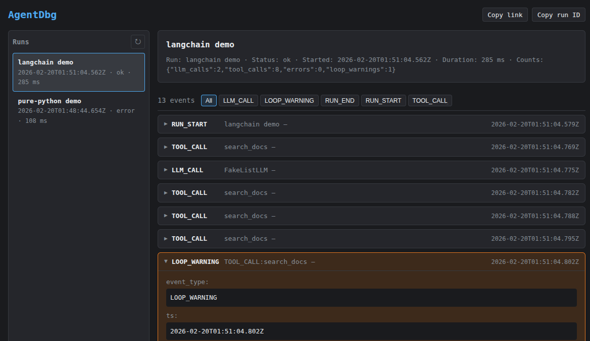

# AgentDbg



**The step-through debugger for AI agents.**

AgentDbg captures a structured trace of every agent run - LLM calls, tool calls, errors, state updates, loop warnings - and gives you a clean local timeline to see exactly what happened.

Add `@trace`, run your agent, then run:

```
agentdbg view
```

In under 10 minutes, you can inspect a full execution timeline with inputs, outputs, status, and failure evidence - all on your machine.

**No cloud. No accounts. No telemetry.**

## Why AgentDbg?

Agents fail in ways logs don't explain:

- Silent loops that burn tokens
- Tool schema mismatches and malformed arguments
- Prompt regressions ("it worked yesterday")
- Flaky, non-deterministic runs
- "Why did it do that?"

AgentDbg makes agent executions **legible**.

Instead of scattered logs, you get:

- A chronological timeline of events
- Expandable LLM calls (prompt, response, usage)
- Tool calls with args, results, and error status
- Highlighted loop warnings with evidence
- A self-contained run artifact you can export


## What you get (per run)

Each run produces a local artifact:

- `run.json` - metadata, status, counts
- `events.jsonl` - full structured event stream

In the UI, you see:

- Run status (ok / error)
- Duration
- LLM call count
- Tool call count
- Error count
- Loop warnings (if any)

Everything is written to `~/.agentdbg/` as plain JSON files.
Nothing leaves your machine.


## What AgentDbg is

- A **development-time debugger** for AI agents
- **Local-first**: traces stored as JSONL on disk
- **Framework-agnostic**: works with any Python code
- **Redacted by default**: secrets scrubbed before writing to disk
- Built for the "why did it do that?" moment

## What AgentDbg is NOT (v0.1 scope)

- Not a hosted service
- Not a production observability platform
- Not dashboards or alerting
- Not deterministic replay (planned v0.2+)
- Not tied to a single framework

If observability tells you how your system behaves in production, AgentDbg helps you understand why your agent behaved that way while you're building it.

## Get running in 5 minutes

Three commands. No config files, no API keys, no sign-up:

1. [Install (one-time)](#step-1-install)
2. [Run example](#step-2-run-the-example-agent)
3. [`agentdbg view`](#step-3-open-the-timeline)

### Step 1: Install

```bash
git clone https://github.com/AgentDbg/AgentDbg.git
cd AgentDbg
uv venv && uv sync && uv pip install -e .
```

<details>
<summary>No uv? Use pip instead.</summary>

```bash
python -m venv .venv && source .venv/bin/activate
pip install -e .
```

</details>

### Step 2: Run the example agent

```bash
python examples/demo/pure_python.py
```

This simulates a tiny agent that makes several tool and LLM calls and includes loop warnings and errors. Trace data lands in `~/.agentdbg/runs/`.

### Step 3: Open the timeline

```bash
agentdbg view
```

A browser tab opens at `http://127.0.0.1:8712` showing the full run timeline - every event, with inputs, outputs, and timing.


That's it. You're debugging.


## Instrument your own agent

Add three lines to any Python agent:

```python
from agentdbg import trace, record_llm_call, record_tool_call

@trace
def run_agent():
    # ... your existing agent code ...

    record_tool_call(
        name="search_db",
        args={"query": "active users"},
        result={"count": 42},
    )

    record_llm_call(
        model="gpt-4",
        prompt="Summarize the search results.",
        response="There are 42 active users.",
        usage={"prompt_tokens": 12, "completion_tokens": 8, "total_tokens": 20},
    )

run_agent()
```

Then `agentdbg view` to see the timeline.

### What gets captured

| Event | Recorded by | What you see |
|---|---|---|
| Run start/end | `@trace` (automatic) | Duration, status, error if any |
| LLM calls | `record_llm_call()` | Model, prompt, response, token usage |
| Tool calls | `record_tool_call()` | Tool name, args, result, status |
| State updates | `record_state()` | Arbitrary state snapshots |
| Errors | `@trace` (automatic) | Exception type, message, stack trace |
| Loop warnings | Automatic detection | Repetitive pattern + evidence |


## CLI reference

### List recent runs

```bash
agentdbg list              # last 20 runs
agentdbg list --limit 50   # more runs
agentdbg list --json       # machine-readable output
```

### View a run timeline

```bash
agentdbg view              # opens latest run
agentdbg view <RUN_ID>     # specific run
agentdbg view --no-browser # just print the URL
```

### Export a run

```bash
agentdbg export <RUN_ID> --out run.json
```


## Redaction & privacy

**Redaction is ON by default.** AgentDbg scrubs values for keys matching sensitive patterns (case-insensitive) before writing to disk. Large fields are truncated (marked with `__TRUNCATED__` marker).

Default redacted keys: `api_key`, `token`, `authorization`, `cookie`, `secret`, `password`.

```bash
# Override defaults via environment variables
export AGENTDBG_REDACT=1                    # on by default
export AGENTDBG_REDACT_KEYS="api_key,token,authorization,cookie,secret,password"
export AGENTDBG_MAX_FIELD_BYTES=20000       # truncation limit
```

You can also configure redaction in `.agentdbg/config.yaml` (project root) or `~/.agentdbg/config.yaml`.


## Storage

All data is local. Plain files, easy to inspect or delete.

```
~/.agentdbg/
└── runs/
    └── <run_id>/
        ├── run.json        # run metadata (status, counts, timing)
        └── events.jsonl    # append-only event log
```

Override the location:

```bash
export AGENTDBG_DATA_DIR=/path/to/traces
```


## Integrations

AgentDbg is framework-agnostic at its core. The SDK works with any Python code.

### LangChain / LangGraph (v0.1)

Optional callback handler that auto-records LLM and tool events. Requires `langchain-core`:

```bash
pip install -e ".[langchain]"
```

```python
from agentdbg import trace
from agentdbg.integrations import AgentDbgLangChainCallbackHandler

@trace
def run_agent():
    handler = AgentDbgLangChainCallbackHandler()
    # pass to your chain: config={"callbacks": [handler]}
    ...
```

See `examples/langchain/minimal.py` for a runnable example.

### Planned adapters

- OpenAI Agents SDK
- Agno
- Others (AutoGen, CrewAI, custom loops)

Until an adapter exists for your framework, use the core SDK: `@trace` + `record_llm_call` / `record_tool_call`.


## Development

```bash
uv venv && uv sync && uv pip install -e ".[langchain]"
uv run pytest
```


## Roadmap

**Works today (v0.1):**
- `@trace` decorator + `record_llm_call` / `record_tool_call` / `record_state`
- Local JSONL storage with automatic redaction
- `agentdbg list`, `agentdbg view` (timeline UI), `agentdbg export`
- Loop detection (`LOOP_WARNING` events)
- LangChain/LangGraph callback handler

**Planned (v0.2+):**
- Deterministic replay / tool mocking
- OpenAI Agents SDK adapter
- Eval + regression CI
- Optional hosted trace store


## License

Licensed under the Apache License, Version 2.0. See [LICENSE](LICENSE).
